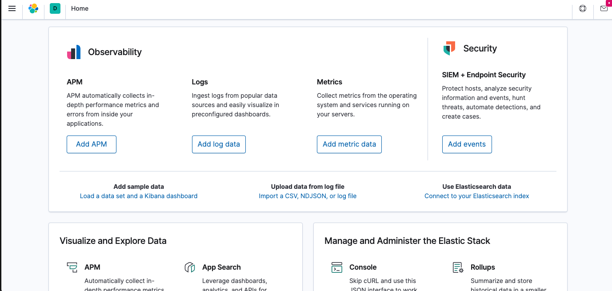
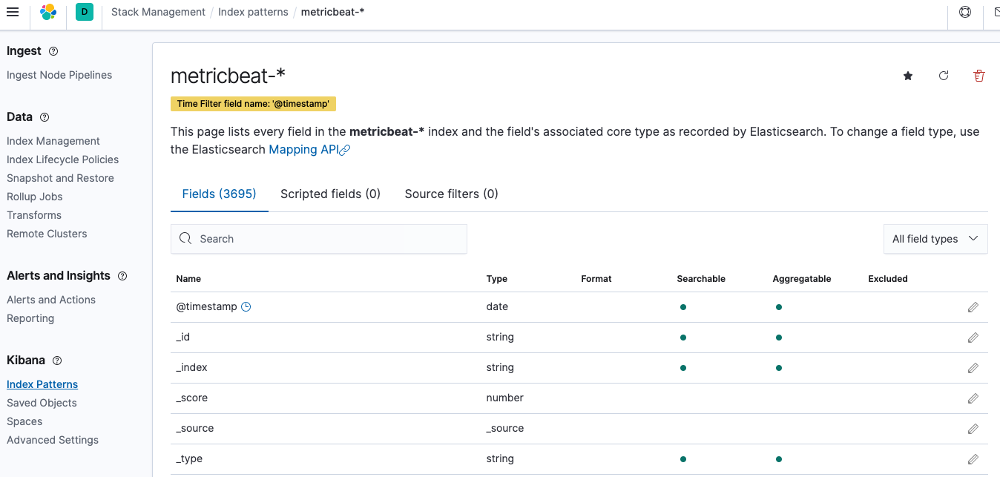
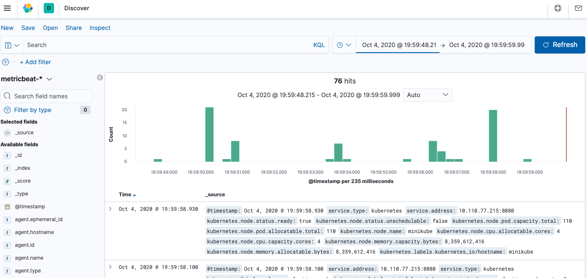

# ELK
How to get ELK setup on Kubernetes

## Background
Modern Logging involves 
- Aggregation – the ability to collect and ship logs from multiple data sources.
- Processing – the ability to transform log messages into meaningful data for easier analysis
- Storage – the ability to store data for extended time periods to allow for monitoring, trend analysis, and security use cases.
- Analysis – the ability to dissect the data by querying it and creating visualizations and dashboards on top of it.

ELK Stack provides a solution for log management and analytics. 

Classic Architecture


Complex Architecture


## ElasticSearch
- Elasticsearch is categorized as a NoSQL database. Elasticsearch stores data in an unstructured way; The new Elasticsearch SQL project will allow using SQL statements to interact with the data. 
- Elasticsearch is used together with the other components in the ELK Stack, Logstash and Kibana, and plays the role of data indexing and storage.
- Index: Elasticsearch Indices are logical partitions of documents and can be compared to a database in the world of relational databases.You could have one index containing all of the data related to the products and another with all of the data related to the customers,different indices will hold documents that are unique to each index.
- Documents: JSON objects that are stored within an Elasticsearch index and are considered the base unit of storage; can be compared to a row in a table (Relational DB). Data in documents is defined with fields comprised of keys and values; also contain reserved fields that constitute the document metadata such as _index, _type and _id.
- Types: Used within documents to subdivide similar types of data wherein each type represents a unique class of documents. Types consist of a name and a mapping; are used by adding the _type field. This field can then be used for filtering when querying a specific type.
- Mapping: Like a schema(in RDB), mapping defines the different types that reside within an index. It defines the fields for documents of a specific type — the data type and how the fields should be indexed and stored in Elasticsearch. A mapping can be defined explicitly or generated automatically when a document is indexed using templates.
- Shards: As soon as an index approaches this limit, indexing will begin to fail. One way to counter this problem is to split up indices horizontally into pieces called shards. This allows you to distribute operations across shards and nodes to improve performance. You can control the amount of shards per index and host these “index-like” shards on any node in your Elasticsearch cluster.
- Replicas: You can make copies of shards called replicas. Because replicas were designed to ensure high availability, they are not allocated on the same node as the shard they are copied from.  Similar to shards, the number of replicas can be defined when creating the index but also altered at a later stage.

## Logstash
- It's in charge of also processing the log messages, enhancing them and massaging them and then dispatching them to a defined destination for storage (stashing).
- Events aggregated and processed by Logstash go through three stages: collection, processing, and dispatching. Which data is collected, how it is processed and where it is sent to, is defined in a Logstash configuration file that defines the pipeline.
- Each of these stages is defined in the Logstash configuration file with what are called plugins — “Input” plugins for the data collection stage, “Filter” plugins for the processing stage, and “Output” plugins for the dispatching stage. 
- Input plugins: Aggregate logs and events from various sources. Logstash can be defined to collect and process data from various sources and send them to other systems for storage and analysis, Common inputs used are `file, beats, syslog, http, tcp, udp, stdin`
```
# file input plugin
input {
    file {
        path => "/var/log/apache/access.log"
        start_position => "beginning"
    }
}
```
- Filter plugins: Enable you to enrich, manipulate, and process logs for parsing log data.Filters can be combined with conditional statements to perform an action if a specific criterion is met, common inputs used are `grok, date, mutate, drop`
```
filter {
    grok {
        match => { "message" => "%{COMBINEDAPACHELOG}" }
    }
    date {
        match => [ "timestamp" , "dd/MMM/yyyy:HH:mm:ss Z" ]
    }
    geoip {
        source => "clientip"
    }
}
```
- Output plugins: Enable you to push your data to various locations, services, and technologies. You can store events using outputs such as `File, CSV, and S3`, convert them into messages with `RabbitMQ and SQS`, or send them to various services like `HipChat, PagerDuty, or IRC`. If you do not define an output, Logstash will automatically create a stdout output. An event can pass through multiple output plugins.
```
output {
    elasticsearch {
    hosts => ["localhost:9200"]
    }
}
```
- Logstash Codecs: Input codecs provide a convenient way to decode your data before it enters the input. Output codecs provide a convenient way to encode your data before it leaves the output.Some common codecs: The default “plain” codec is for plain text with no delimitation between events, `json` codec is for encoding JSON events, `json_lines` codec allows you either to receive and encode/decode json events delimited by `\n`, `rubydebug` to output Logstash events as data Ruby objects.

## Kibana
- Kibana is a browser-based user interface that can be used to search, analyze and visualize the data stored in Elasticsearch indices
- Searching: Users now use a new querying language called KQL (Kibana Querying Language) to search their data.
```  
    - Free text searches – used for quickly searching for a specific string.
    - Field-level searches – used for searching for a string within a specific field.
    - Logical statements – used to combine searches into a logical statement.
    - Proximity searches – used for searching terms within a specific character proximity.
```
- Filtering: Kibana includes a filtering dialog that allows easier filtering of the data displayed in the main view, click the `Add a filter +` button under the search box and begin experimenting with the conditionals.
- Visualizations: Kibana visualizations are built on top of Elasticsearch queries. Using Elasticsearch aggregations (e.g. sum, average, min, mac, etc.), you can perform various processing actions to make your visualizations depict trends in the data.
```
    - Basic Charts  (Area, Heat Map, Horizontal Bar, Line, Pie, Vertical bar)
    - Data (Date Table, Gauge, Goal, Metric)
    - Maps (Coordinate Map, Region Map)
    - Time series (Timelion, Visual Builder)
    - Other (Controls, Markdown, Tag Cloud)
```
- Dashboards: You can add individual visualizations into one comprehensive visualization called a dashboard. Dashboards give you the ability to monitor a system or environment from a high vantage point for easier event correlation and trend analysis.
- Kibana Pages: Dedicated Monitoring Services
```
    - Canvas – the “photoshop” of machine-generated data, Canvas is an advanced visualization tool that allows you to design and visualize your logs and metrics in creative new ways.

    - Maps – meant for geospatial analysis, this page supports multiple layers and data sources, the mapping of individual geo points and shapes, global searching for ad-hoc analysis, customization of elements, and more.

    - Infrastructure – helps you gain visibility into the different components constructing your infrastructure, such as hosts and containers.

    - Logs – meant for live tracking of incoming logs being shipped into the stack with Logstash.

    - APM – designed to help you monitor the performance of your applications and identify bottlenecks.  

    - Uptime – allows you to monitor and gauge the status of your applications using a dedicated UI, based on data shipped into the stack with Heartbeat.

    - Stack Monitoring –  provides you with built-in dashboards for monitoring Elasticsearch, Kibana, Logstash and Beats. Requires manual configuration
```

## Beats
- Beats are a collection of open source log shippers that act as agents installed on the different servers in your environment for collecting logs or metrics. 
- They are Written in Go, lightweight,leave a small installation footprint, are resource efficient, and function with no dependencies.
- Types:
```
- Filebeat is used for collecting and shipping log files. Filebeat can be installed on almost any operating system, including as a Docker container, and also comes with internal modules for specific platforms such as Apache, MySQL, Docker and more, containing default configurations and Kibana objects for these platforms.

- Packetbeat captures network traffic between servers, and as such can be used for application and performance monitoring. Packetbeat can be installed on the server being monitored or on its own dedicated server.

- Metricbeat collects ships various system-level metrics for various systems and platforms. Like Filebeat, Metricbeat also supports internal modules for collecting statistics from specific platforms. You can configure the frequency by which Metricbeat collects the metrics and what specific metrics to collect using these modules and sub-settings called metricsets.

- Winlogbeat is designed specifically for collecting Windows Event logs. It can be used to analyze security events, updates installed, and so forth.

- Auditbeat can be used for auditing user and process activity on your Linux servers.Similart to other system auditing tools (systemd, auditd), Auditbeat can be used to identify security breaches — file changes, configuration changes, malicious behavior, etc.  

- Functionbeat is defined as a “serverless” shipper that can be deployed as a function to collect and ship data into the ELK Stack. Designed for monitoring cloud environments. 
```

- Example (filebeat) config
```
filebeat.prospectors:
  - type: log
enabled: true
paths:
  - /var/log/puppetlabs/puppetserver/puppetserver.log.json
  - /var/log/puppetlabs/puppetserver/puppetserver-access.log.json
json.keys_under_root: true
output.elasticsearch: null
hosts:
  - 'localhost:9200'
```

## Setup Minikube /w Helm Addon
If you don't have minikube already installed, [click here](https://kubernetes.io/docs/tasks/tools/install-minikube/)

If you already do, proceed.
```
minikube config set memory 8192
minikube config set cpus 4
minikube start
minikube addons enable helm-tiller
```
> If you want to see a dashboard, you can open up a new terminal, set your kubeconfig to point to `[minikube:default]` and execute `minikube dashboard`

## Installing ELK via Helm

`helm repo add elastic https://Helm.elastic.co`

## ElasticSearch
Helm configuration for installing a multi-node Elasticsearch cluster on Minikube can be found on `elastic-search-vaulues.yaml`

```
helm install --name elasticsearch elastic/elasticsearch -f elastic-search-values.yaml

==> v1/Pod(related)                
elasticsearch-master-0  
elasticsearch-master-1  
elasticsearch-master-2  

==> v1/Service
NAME                           TYPE       CLUSTER-IP    PORT(S)           
elasticsearch-master           ClusterIP  10.105.22.66  9200/TCP,9300/TCP 
elasticsearch-master-headless  ClusterIP  None          9200/TCP,9300/TCP 

==> v1/StatefulSet           
elasticsearch-master 

==> v1beta1/PodDisruptionBudget
NAME                    
elasticsearch-master-pdb
```

> Verify using `kubectl port-forward svc/elasticsearch-master 9200`
```
curl  http://localhost:9200  

{
  "name" : "elasticsearch-master-1",
  "cluster_name" : "elasticsearch",
  "cluster_uuid" : "m21HUyZvTHSkzqX31rSLJQ",
  "version" : {
    "number" : "7.9.2",
    "build_flavor" : "default",
    "build_type" : "docker",
    "build_hash" : "d34da0ea4a966c4e49417f2da2f244e3e97b4e6e",
    "build_date" : "2020-09-23T00:45:33.626720Z",
    "build_snapshot" : false,
    "lucene_version" : "8.6.2",
    "minimum_wire_compatibility_version" : "6.8.0",
    "minimum_index_compatibility_version" : "6.0.0-beta1"
  },
  "tagline" : "You Know, for Search"
}
```

## Kibana
```
helm install --name kibana elastic/kibana
```
```
==> v1/Deployment
NAME           
kibana-kibana  

==> v1/Pod(related)
NAME                          
kibana-kibana-576bf6c7c6-4lbfj  

==> v1/Service
NAME           TYPE       CLUSTER-IP     PORT(S)  
kibana-kibana  ClusterIP  10.108.92.231  5601/TCP 
```
> Verify using `kubectl port-forward service/kibana-kibana 5601` and browse to `http://localhost:5601/app/home`



## LogStash
```
helm install --name logstash elastic/logstash
```
```
==> v1/Pod(related)
NAME                 
logstash-logstash-0

==> v1/Service
NAME                        TYPE       CLUSTER-IP   PORT(S)   AGE
logstash-logstash-headless  ClusterIP  None         9600/TCP  1s

==> v1/StatefulSet
NAME               
logstash-logstash  0/1    1s

==> v1beta1/PodDisruptionBudget
NAME                  
logstash-logstash-pdb 
```
> give it a few minutes for the readiness-probe to get sorted and pod to spin up successfully

> Verify using `kubectl port-forward svc/logstash-logstash-headless 9600`

```
curl localhost:9600

{
  "host": "logstash-logstash-0",
  "version": "7.9.2",
  "http_address": "0.0.0.0:9600",
  "id": "9c3e5b63-9f30-4ea8-876e-2ff5f43781bd",
  "name": "logstash-logstash-0",
  "ephemeral_id": "3cd0ec68-9322-49a4-bb97-46d669a8139d",
  "status": "green",
  "snapshot": false,
  "pipeline": {
    "workers": 1,
    "batch_size": 125,
    "batch_delay": 50
  },
  "build_date": "2020-09-23T03:12:32Z",
  "build_sha": "0d3d0617adaa8c0c770469c9c32e18514b5d8f15",
  "build_snapshot": false
}
```
> You could also `curl -XGET 'localhost:9600/_node/hot_threads?human=true'` to view Java threads with high CPU and extended execution times. [More APIs](https://www.elastic.co/guide/en/logstash/current/monitoring-logstash.html)


## MetricBeat
```
helm install --name metricbeat elastic/metricbeat
```
```
==> v1/ConfigMap                           
metricbeat-metricbeat-daemonset-config  
metricbeat-metricbeat-deployment-config 

==> v1/DaemonSet

metricbeat-metricbeat

==> v1/Deployment
metricbeat-kube-state-metrics  
metricbeat-metricbeat-metrics 

==> v1/Pod(related)
metricbeat-kube-state-metrics-78775f5d68-hb522
metricbeat-metricbeat-58xns
metricbeat-metricbeat-metrics-795bdcc85f-h9pwv

==> v1/Service
NAME                           TYPE       CLUSTER-IP    PORT(S)   
metricbeat-kube-state-metrics  ClusterIP  10.110.77.215 8080/TCP 

==> v1/ServiceAccount
NAME                           SECRETS  
metricbeat-kube-state-metrics  1     
metricbeat-metricbeat          1    

==> v1beta1/ClusterRole
metricbeat-kube-state-metrics
metricbeat-metricbeat-cluster-role

==> v1beta1/ClusterRoleBinding
metricbeat-kube-state-metrics
metricbeat-metricbeat-cluster-role-binding
```

### Verify Indexes in ElasticSearch 

> Verfiy using `kubectl port-forward svc/elasticsearch-master 9200`

```
curl localhost:9200/_cat/indices                                                  
green open .kibana-event-log-7.9.2-000001     EtyavU09R5yK-hKZoy9Ukw 1 1     2  0  21.7kb 10.8kb
green open .apm-custom-link                   n0aj3z6kTS-H6v3mbUz_Tw 1 1     0  0    416b   208b
green open .kibana_task_manager_1             YxgOMw3QRHCo3hoywLiT0w 1 1     6 60 121.4kb 54.8kb
green open .apm-agent-configuration           tZmvSr6QRdO35_g5gr2QBw 1 1     0  0    416b   208b
green open metricbeat-7.9.2-2020.10.04-000001 jLDtCNRLQR2pTJ_uXNLeSQ 1 1  2071  0   3.6mb  1.8mb
green open kibana_sample_data_logs            KJFhcpoxThSTwEhRCxCWpA 1 1 14074  0  19.5mb  9.8mb
green open .async-search                      Qm81RBR6RqidvgrqQSpnLw 1 1     3 26  34.3kb 16.9kb
green open .kibana_1                          NXNSrAOGQiSNRxasJNEUCA 1 1    60 10    21mb 10.5mb
```

## Let's Analyze data
> Analysis using `kubectl port-forward service/kibana-kibana 5601`

- Browse to `http://localhost:5601/app/management/data/index_management/indices` where you should see your `metricbeat-index` show up.

### Create a new index pattern

- Go to http://localhost:5601/app/management/kibana/indexPatterns/create

- Enter `metricbeat-*` in text-box and click `Next Step`

- Select Primary Timefield as `@timestamp` then click `Create Index Pattern` button.

- You should see that your index pattern has been created


- Check logs in Kibaba


## Manifest References
Chart manifests are available in the chart-manifests folder.

# Cleanup
`minkube stop`
`minikube delete`
